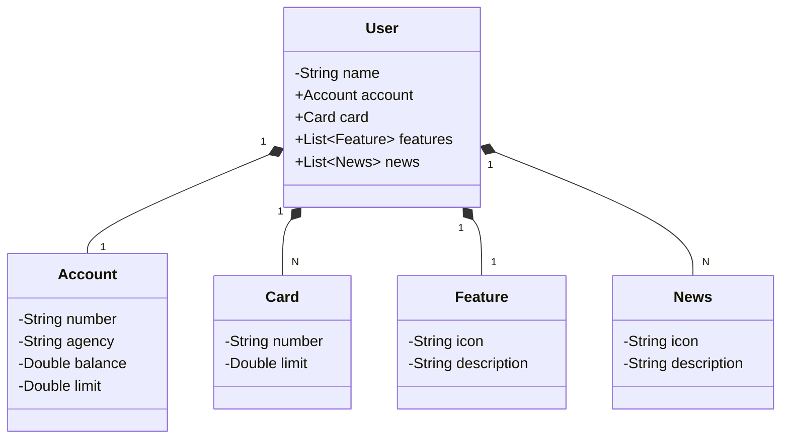

# API REST com Spring Boot 3 e Railway
- Descrição
---

####  Tecnologias Utilizadas
- **Json Editor Online**
    - Esta ferramenta facilita a validação
      de estruturas JSON, ajudando a identificar
      erros de formatação.
  ```bash
  https://jsoneditoronline.org/
  ```  
    - Estrutura Json

  ```bash
  {
  "name":"Cristian",
  "account":{
    "number":"00000000-0",
    "agency":"0000",
    "balance":1324.64,
    "limit":1000.00
  },
  "features":[
    {
      "icon":"",
      "description":"Descrição da features"
    }
  ],
  "card":{
    "number":"xxxx xxxx xxxx 0000",
    "limit":1000.00
  },
  "news":[
    {
      "icon":"",
      "description":"Descrição da notícia"
    }
  ]
  }

  ```
- **Chat GPT**

    - Utilizado para criar um **_diagrama de classes_**
      em Mermaid através do Json fornecido.


- **H2 Database Console**

    - O H2 é um banco de dados em memória comumente utilizado em ambientes
      de desenvolvimento para testes rápidos e simulação de ambientes de produção.
    - O console do H2 oferece uma interface web para que você possa visualizar
      e manipular dados diretamente.
- **_Acessando o console H2_**
    - Certifique-se de que o console do H2 esteja habilitado nas configurações da
      aplicação. Para isso, adicione as seguintes propriedades no seu arquivo
      application.properties (ou application.yml).
    - **_application.properties_**:

   ````
    # Configuração do banco de dados H2
    spring.datasource.url=jdbc:h2:mem:sdw2024
    spring.datasource.username=sdw2024
    spring.datasource.password=

    # Configuração do console H2
    spring.h2.console.enabled=true
    spring.h2.console.path=/h2-console

    # Configuração do JPA e Hibernate
    spring.jpa.show-sql=true
    spring.jpa.open-in-view=false
    spring.jpa.hibernate.ddl-auto=create
    spring.jpa.properties.hibernate.format_sql=true

   ````
    - Inicie a aplicação
    - Acesse o console do H2 no navegador pelo endereço:
  ````
  http://localhost:8080/h2-console 
  ````
  

    - OBS Em ambientes de produção, desative o console H2 no application.properties.

- **Swagger UI**
    - A documentação da API está disponível através do Swagger UI.
    - Você pode acessar a interface interativa para explorar e testar os endpoints da API usando o seguinte link:

    ```bash
    http://localhost:8080/swagger-ui/index.html
    ```
1. **Certifique-se de que a aplicação está em execução**: O Swagger UI está disponível somente quando a aplicação está em execução.
2. **Acesse o endereço**: Abra um navegador e insira a url acima  para visualizar a documentação da API.

- Se a aplicação estiver rodando em uma URL diferente ou porta diferente, ajuste o endereço conforme necessário.


3. **Exemplos de Requisição**

- Abaixo estão exemplos de como enviar dados no corpo da requisição
  para os endpoints da API usando o Swagger UI.

    - Endpoint
        - **Descrição**: Cria um usuário no banco de dados.
        - **Método**: POST /users
        - **Corpo da Requisição:**
    ```bash
  {
  "name":"Cristian",
  "account":{
    "number":"00000000-0",
    "agency":"0000",
    "balance":1324.64,
    "limit":1000.00
  },
  "features":[
    {
      "icon":"",
      "description":"Descrição da features"
    }
  ],
  "card":{
    "number":"xxxx xxxx xxxx 0000",
    "limit":1000.00
  },
  "news":[
    {
      "icon":"",
      "description":"Descrição da notícia"
    }
  ]
  }
  ````

    - Endpoint
        - **Descrição**: Busca um usuário no banco de dado pelo seu ID.
        - **Método**: GET /users/{id}
        - **OBS:** Neste caso deverá passar o Id no campo Description.
---

#### Banco de dados com Railway

Railway é uma plataforma que oferece bancos de dados em nuvem e serviços relacionados. 
Neste projeto, utilizamos o Railway para gerenciar o banco de dados de nossa aplicação.
````
 https://railway.app/
````


   

